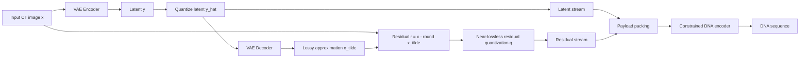
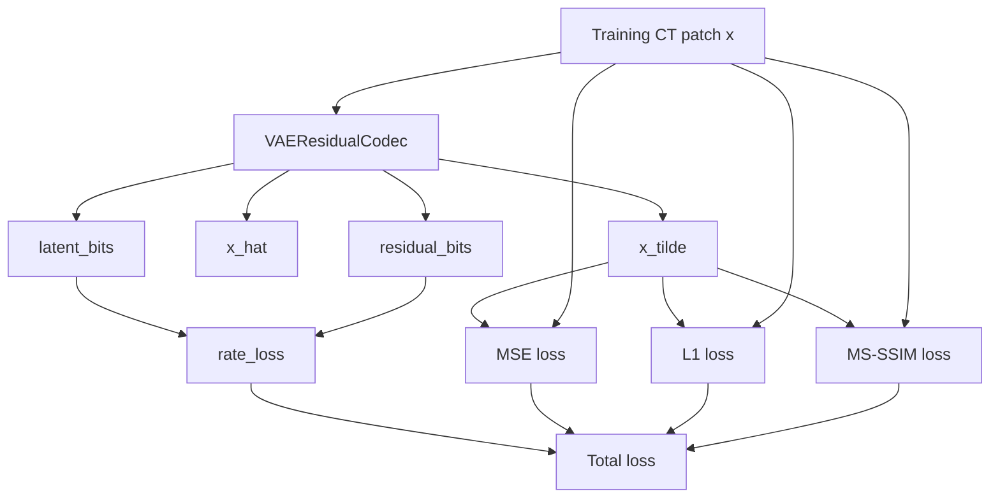
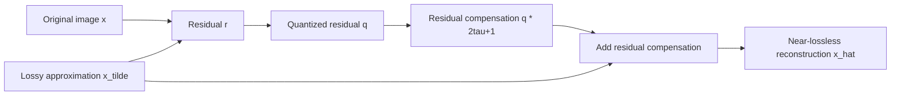
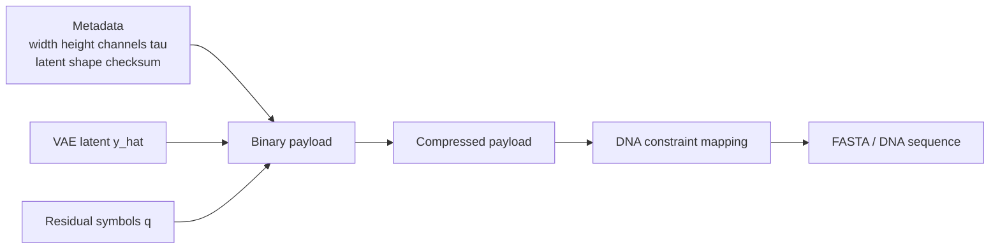
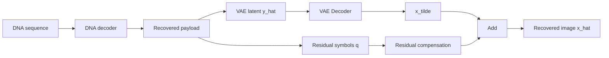
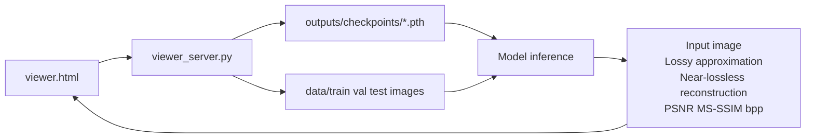

# VAE Residual DNA Storage Scheme

## Overall Pipeline



## Training Objective



Total loss:

```text
loss = rate_loss
     + lambda_distortion * MSE(x_tilde, x)
     + lambda_l1 * L1(x_tilde, x)
     + lambda_ms_ssim * (1 - MS_SSIM(x_tilde, x))
```

## Near-lossless Reconstruction



Residual rule:

```text
step = 2 * tau + 1
q = round((x - round(x_tilde)) / step)
x_hat = round(x_tilde) + q * step
```

## DNA Payload Composition



Current measured composition on 512 x 512 CT examples:

```text
VAE latent sequence:     about 21,133 nt  ~= 8.2%
Residual sequence:       about 237,336 nt ~= 91.8%
Total DNA sequence:      about 258,468 nt
Approximate compression: about 4.06:1 versus raw 8-bit DNA mapping
```

## Decoding Pipeline



## Web Viewer


